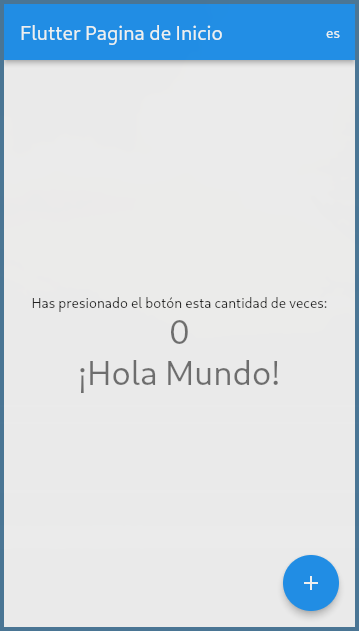
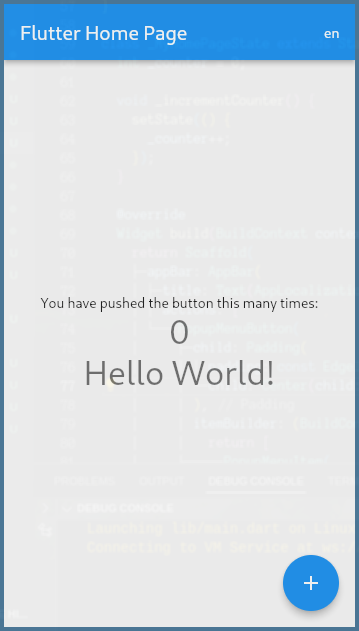

# Flutter samples
[![License: MIT][license_badge]][license_link]

Project to show samples in Flutter.

---

## Localization





## Installation

- Check if you are in the stable channel of flutter SDK and the version v2.14.0 or higher. [Instruction to change flutter channel](https://github.com/flutter/flutter/wiki/Flutter-build-release-channels#how-to-change-channels).
- Clone the repo, this repo containt many examples so you could download with [this steps](https://github.com/oscarnar/flutter_examples#a-specific-example).

    In Arch Linux, you can clone the specific example using [subversion](https://archlinux.org/packages/extra/x86_64/subversion/) package:

    If the path of the example is:
    https://github.com/oscarnar/flutter_examples/tree/main/flutter_sample

    Then, you need change 'tree/main' to 'trunk', so after that you can run it using:

    ```bash
    svn checkout https://github.com/oscarnar/flutter_examples/trunk/flutter_sample
    ```

- And then we can use the normal build and run procedure
  ```sh
  flutter pub get
  flutter run
  ```


---

[flutter_localizations_link]: https://api.flutter.dev/flutter/flutter_localizations/flutter_localizations-library.html
[internationalization_link]: https://flutter.dev/docs/development/accessibility-and-localization/internationalization
[license_badge]: https://img.shields.io/badge/license-MIT-blue.svg
[license_link]: https://opensource.org/licenses/MIT
